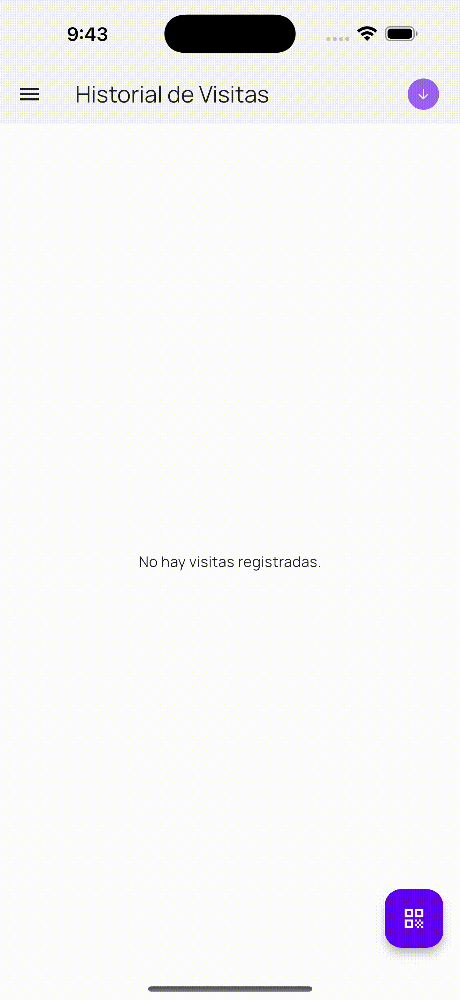

# Field Visit App

Registro inteligente de visitas técnicas en campo.

## Descripción

Field Visit App es una aplicación móvil desarrollada en Flutter que permite a técnicos de campo registrar visitas a equipos mediante el escaneo de códigos QR o de barras, con funcionalidades de geolocalización, modo offline y control de roles.

## Tiempo de Desarrollo 

- 18 Horas aproximadamente

## Getting Started

### Prerequisitos

Antes de comenzar, asegúrate de tener instalados:

- **Flutter** – Framework principal para el desarrollo multiplataforma. [Flutter](https://docs.flutter.dev/get-started/install) (>= 3.x.x)
- **VSCode** o **Android Studio**
- **Un emulador o dispositivo físico** (iOS o Android)
- **Sembast** – Base de datos local.
- **Meedu** – Manejo de estado y navegación reactiva.
- **GoRouter** – Navegación declarativa.
- **Freezed & JSON Serializable** – Modelado de datos y parsing JSON.
- **Geolocator** – Obtención de ubicación GPS.
- **Camera / QR Scanner** – Escaneo de códigos QR o de barras.
- **Dart** – Lenguaje base de la aplicación.

### Clonar el proyecto

```bash
git clone git@github.com:bakamedi/field_visit_app.git
cd field_visit_app
```

### Instalar dependencias

```bash
$ flutter pub get
$ dart run build_runner build -d --delete-conflicting-outputs
$ flutter run
```
# Guía antes de comenzar

Para simular el scaneo QR aquí se deja una imagen para pruebas, no contine información alguna ya que la app genera codigos aleatorios, pero es necesario para simular el escaneo.

<div style="display: flex; flex-wrap: wrap; gap: 10px;">

  

</div>

# App Images

## iOS

<div style="display: flex; flex-wrap: wrap; gap: 10px;">
  
  
  
  
</div>

## Android

<div style="display: flex; flex-wrap: wrap; gap: 10px;">
  

  
  
  
</div>

## Dark Mode

<div style="display: flex; flex-wrap: wrap; gap: 10px;">

  

</div>

</div>

## Licencia
Copyright (c) 2025 Bakke Andrés Medina Abarca